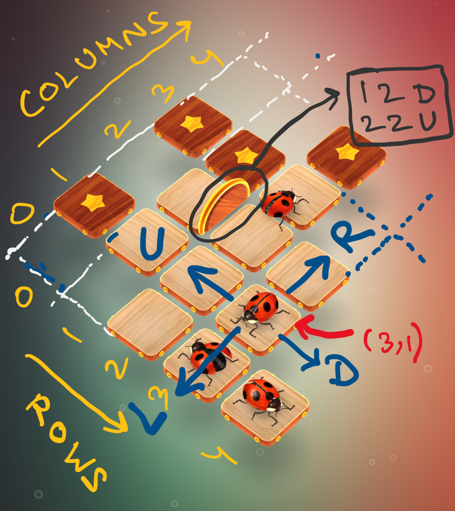

# HumBug

## Input format
* The `board` is seen as a grid with possibly, some missing tiles (see figure). 
* $0$-indexing is used to represent coordinates (see figure).
    
    - The first lines contains, 2 spaces integers $n$, $m$, the number of rows and columns in the board.
    - Each of the following $n$ lines contain $m$ spaced integers, describing that position on the board as:  
        - $0$ : not a tile on board  
        - $1$ : empty tile on board  
        - $2$ : tile with star
        - $3$ : snail
        - $4$ : grasshopper
        - $5$ : ladybug
        - $6$ : honeybee
        - $7$ : spider
        - $8$ : butterfly
    - The next line contains an integer $t$, the number of walls.
    - Each of the next $t$ lines describe a wall.
    - If a wall is shared by $2$ tiles, it will appear twice.
    - Each of the $t$ lines contain $2$ spaces integers, describing a cell and a single character from $\{L , R , U , D\}$ describing the position of the wall in that cell (see figure).
    - The next line contained $q$, the maximum number of moves allowed. 

## Output format
* If it is not possible to complete the game in the given input number of steps, the output file contains a single line, that has written `not possible!`
* Otherwise, each of the lines, sequentially describle the move used to compete the game as:
    - `coordinate -> move_direction`
    - Here `move_direction` is one of $\{L , R , U , D\}$ (see figure)
    - for example: `(2,2) -> D`
* It is assured that there will necesarily be a `bug` at the `coordinate` presented in the output. 

